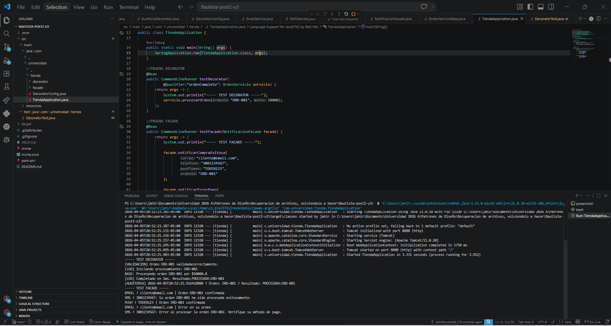

# Bautista-post2-u3
Actividad Post-Contenido 2 / Unidad 3

# Bautista-post2-u3
Actividad Post-Contenido 2 / Unidad 3

Taller Patrones de Diseño — Unidad 3
Proyecto: Servidor de Tienda (Decorator + Facade)
Autor

Jahir Bautista

Descripción del Proyecto

Este proyecto implementa dos patrones estructurales:

Decorator: Permite añadir funcionalidades a un servicio de órdenes sin modificar su clase base.
Facade: Simplifica la interacción con un subsistema de notificaciones multicanal.

El sistema simula el procesamiento de órdenes en una tienda virtual y el envío de notificaciones al cliente.

Estructura del Proyecto
src/
 ├── main/java/com/universidad/tienda/
 │   ├── decorator/
 │   │   ├── OrdenServicio.java
 │   │   ├── OrdenServicioBase.java
 │   │   ├── OrdenServicioDecorator.java
 │   │   ├── LoggingDecorator.java
 │   │   ├── ValidacionDecorator.java
 │   │   └── AuditoriaDecorator.java
 │   │
 │   ├── facade/
 │   │   ├── EmailService.java
 │   │   ├── SMSService.java
 │   │   ├── PushService.java
 │   │   └── NotificacionFacade.java
 │   │
 │   ├── DecoratorConfig.java
 │   └── TiendaApplication.java
 │
 └── test/java/com/universidad/tienda/
     └── DecoratorTest.java
Patrón Decorator
Objetivo

Permitir añadir funcionalidades (logging, validación y auditoría) de forma dinámica sin modificar la clase base.

Cadena de ejecución

Auditoria → Validacion → Logging → Base

Funcionamiento
OrdenServicioBase: procesa la orden
LoggingDecorator: mide tiempo de ejecución
ValidacionDecorator: valida los datos de entrada
AuditoriaDecorator: registra el resultado
Configuración con Spring
@Bean("ordenCompleto")
public OrdenServicio ordenServicioCompleto(@Qualifier("ordenBase") OrdenServicio base) {
    return new AuditoriaDecorator(
        new ValidacionDecorator(
            new LoggingDecorator(base)
        )
    );
}
Patrón Facade
Objetivo

Ocultar la complejidad de múltiples servicios de notificación bajo una interfaz simple.

Subsistema
EmailService
SMSService
PushService
Fachada
public void notificarCompraExitosa(...) {
    email.enviar(...);
    sms.enviar(...);
    push.enviar(...);
}
Beneficio

El cliente realiza una sola llamada mientras el sistema ejecuta múltiples servicios internamente.

Pruebas con JUnit 5

Se implementaron cuatro pruebas:

Orden válida
Monto inválido
ID vacío
Decorador individual (logging)
Ejecución
mvn test

Todos los tests se ejecutan correctamente sin errores.

Ejecución del Proyecto
Compilación
mvn clean package
Ejecución
mvn spring-boot:run
Evidencias

Se deben incluir capturas de pantalla de:

Consola ejecutando el patrón Decorator
Consola ejecutando el patrón Facade
Resultado de la ejecución de pruebas
Mensaje de BUILD SUCCESS
Conclusiones
Se aplicó el principio Open/Closed de SOLID.
Se utilizó composición en lugar de herencia.
El patrón Decorator permite extender funcionalidades sin modificar código existente.
El patrón Facade simplifica el uso de subsistemas complejos.
Requisitos cumplidos
Proyecto funcional con Spring Boot
Implementación de los patrones Decorator y Facade
Pruebas con JUnit 5
Build exitoso con mvn clean package
Tests exitosos con mvn test
Mínimo tres commits descriptivos
Repositorio público
Comandos clave
mvn clean package
mvn test
git add .
git commit -m "feat: implementación patrones decorator y facade"
git push
Resultado

Proyecto completo y listo para entrega, cumpliendo con los criterios de evaluación establecidos.

Imagen de consola

